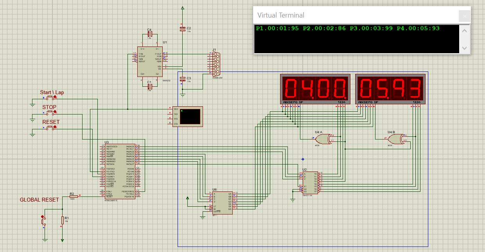

# ATMEGA_STOPWATCHV2
## Описание
Таймер для команд учавствующих в эстафетах 4х100м или 4х200м.
## Характеристики
Использованный мк: ATMega8515  
Предел измеряемого времени: 59мин 59с 99мс  
Количество участников: 4  
Передача данных: по UART
## Схема
